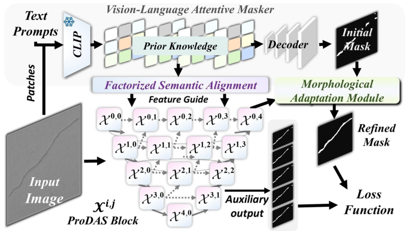

# ProDAS: Prompt-Driven Adaptive Segmenter for Surface Defect Segmentation

**Zhiyong He, Chuanning Wang, Guo Yi, Yanzhao Zhou, Zhenxiong Gu, Song Lin**

## Abstract

Precise surface defect segmentation is vital for industrial quality control, yet the performance of deep learning models is often constrained by the availability of large-scale annotated data. This challenge stems from the prevalent implicit learning paradigm, which limits the models' ability to generalize from sparse data where high-level semantic context is crucial. To address this, we propose ProDAS (Prompt-Driven Adaptive Segmenter), a novel framework built on a synergistic learning paradigm that augments a data-driven visual backbone with explicit knowledge from natural language prompts. ProDAS employs a dual-guidance mechanism: a Vision-Language Attentive Masker (VLAM) translates prompts into strong spatial priors, while a Factorized Semantic Alignment (FSA) module injects this textual guidance at multiple scales into the backbone. The visual backbone is further enhanced by a Multi-Attention Feature Refinement Module (MAFRM) to capture discriminative features. Comprehensive evaluations demonstrate state-of-the-art performance, with the framework excelling in data-scarce scenarios. For instance, it achieves an impressive 80.6% mIoU on Short Weft defects in a one-shot setting. Its high robustness against industrial degradations, coupled with an inference speed of 49 FPS on an NVIDIA RTX 4060 8G GPU, validates the efficacy of our synergistic paradigm and establishes ProDAS as a practical solution for real-world manufacturing.

